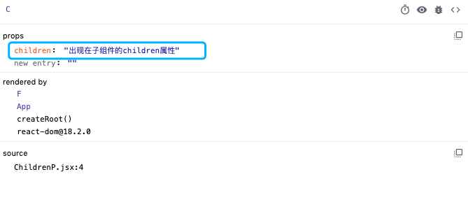

## React 组件进阶

### [children属性](./src/ChildrenP.jsx)
目的: 高阶组件 

children属性表示该组件的子节点,只要组件内部有子节点,props中就有该属性;
```jsx
function F() {
  return (
    <>
      <C>出现在子组件的children属性</C>
    </>
  );
}

function C(props) {
  return (
    <div>
      {props.children}
    </div>
  );
}
```


children可以是`普通文本`, `普通标签元素`, `函数`, `JSX`;

### [Props 校验](./src/PropsCheck.jsx)
对于组件来说，props是由外部传入的，我们其实无法保证组件使用者传入了什么格式的数据，如果传入的数据格式不对，就有可能会导致组件内部错误 

#### 实现步骤
1. 安装属性校验包: `yarn add prop-types`
2. 导入`prop-types`
3. 使用`组件名.propTypes = {}`给组件添加校验规则

#### [规则说明](https://reactjs.org/docs/typechecking-with-proptypes.html)
1. 常见类型`array`, `bool`, `func`, `number`, `object`, `string`;
2. React元素类型 `element`;
3. 必填项 `isRequired`;
4. 特定的结构对象 `shape({})`

#### 默认值
通过 defaultProps 可以给组件的props设置默认值，在未传入props的时候生效
```jsx
// function
// 1
List.defaultProps = {
  pageSize: 10,
}

// 2
function List({pageSize=10}){}

// class
class List extends React.Component {
  static defaultProps = {
    pageSize: 10
  }
}
```
